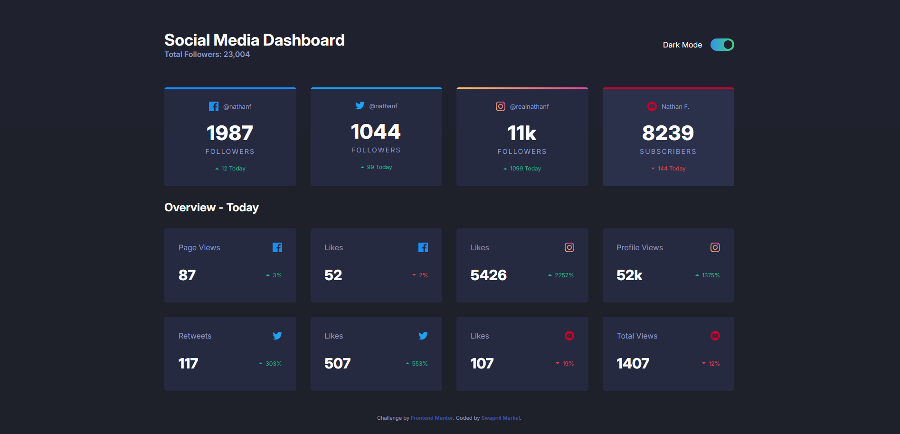

# Frontend Mentor - Social media dashboard with theme switcher solution

This is a solution to the [Social media dashboard with theme switcher challenge on Frontend Mentor](https://www.frontendmentor.io/challenges/social-media-dashboard-with-theme-switcher-6oY8ozp_H). Frontend Mentor challenges help you improve your coding skills by building realistic projects. 

- [Challenge Description](challenge.md)
- [Style Guide](style-guide.md)

## Table of contents

- [Overview](#overview)
  - [The challenge](#the-challenge)
  - [Screenshot](#screenshot)
  - [Links](#links)
- [My process](#my-process)
  - [Built with](#built-with)
  - [What I learned](#what-i-learned)
- [Author](#author)

## Overview

### The challenge

Users should be able to:

- View the optimal layout for the site depending on their device's screen size
- See hover states for all interactive elements on the page
- Toggle color theme to their preference

### Screenshot

### Links

- Solution URL: [Github](https://github.com/Cjmax10/social-media-dashboard)
- Live Site URL: [Live Site](https://cjmax10.github.io/social-media-dashboard/)

## My process

### Built with

- Semantic HTML5 markup
- CSS custom properties
- Flexbox
- CSS Grid
- CSS Transitions

### What I learned

Working with CSS Transitions. Making sure every transition is timed perfectly

## Author

- Website - [Swapnil Markal](https://cjmax10.github.io/Portfolio/)
- Frontend Mentor - [@Cjmax10](https://www.frontendmentor.io/profile/Cjmax10)
